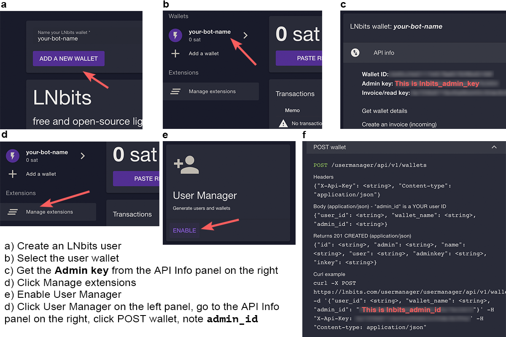
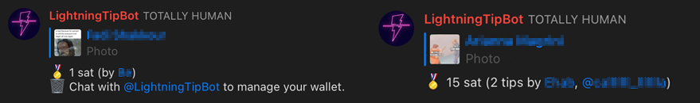

<p align="center">
  	
</p> 


# @LightningTipBot 🏅

A tip bot for Telegram group chats that can send and receive Bitcoin via the Lightning Network ⚡️. It can also be used as a personal Lightning wallet by anyone who has a Telegram account. 

This repository contains everything you need to set up and run your own tip bot. If you simply want to use this bot in your group chat without having to install anything just start a conversation with [@LightningTipBot](https://t.me/LightningTipBot) and invite it into your chat. 

## Setting up the bot
### Installation
To build the bot from source, clone the repository and compile the source code.

```
git clone https://github.com/LightningTipBot/LightningTipBot.git
cd LightningTipBot
go build .
cp config.yaml-example config.yaml
```

Alternatively, you can download binary releases [here](https://github.com/LightningTipBot/LightningTipBot/releases) **(note: no realses yet)**. 

After you have configured the bot, start it using the command

```
./LightningTipBot
```

### Configuration

You need to edit `config.yaml` before starting the bot.

#### Create a Telegram bot

First, create a new Telegram bot by starting a conversation with the [@BotFather](https://core.telegram.org/bots#6-botfather). After you have created your bot, you will get an **Api Token** which you need to add to `telegram_api_key` in config.yaml accordingly. 

#### Set up LNbits 

You can either use your own LNbits instance (recommended) or create an account at [lnbits.com](https://lnbits.com/) to use their custodial service (easy).

1. Create a wallet in LNbits (`lnbits_url`).
2. Get the **Admin key** in the API Info tab of your user (`lnbits_admin_key`).
3. Enable the User Manager extension.
4. Get the **Admin ID** of the User Manager (`lnbits_admin_id`).

#### Getting LNbits keys

<p align="center">
  	
</p> 

#### More configuration
* `webhook_server`: URL that can reach the bot. This is used for creating webhooks with LNbits to receive notifications about payments (optional).
* `db_path`: User database file path.
* `transactions_path`: Transaction log file path. 
* `message_dispose_duration`: Duration in seconds after which commands will be deleted from channel (only if the bot is channel admin).

## Features

### Commands
```
/tip 🏅 Reply to a message to tip it: /tip <amount> [<memo>]
/balance 👑 Check your balance: /balance
/send 💸 Send funds to a user: /send <amount> <@username> [<memo>]
/invoice ⚡️ Create a Lightning invoice to receive payments: /invoice <amount> [<memo>]
/pay ⚡️ Pay a Lightning invoice: /pay <invoice>
/help 📖 Read this help.
```

### Live tooltips

The bot replies to a tipped message to indicate to all participants how many and what amount of tips a post has received. This tooltip will be updated as new tips are given to a post.

<p align="center">
  	
</p> 

### Auto-delete commands

To minimize the clutter all the heavy tipping can cause in a group chat, the bot will remove all failed commands (for example due to a syntax error) from the chat immediately. All successful commands will stay visible for `message_dispose_duration` seconds (default 10s) and then be removed. The tips will sill be visible for everyone in the Live tooltip. This feature only works, if the bot is made admin of the group. 

## Made with
* [LNbits](https://github.com/lnbits/lnbits) – Free and open-source lightning-network wallet/accounts system.
* [telebot](https://github.com/tucnak/telebot) – A Telegram bot framework in Go.
* [gozxing](https://github.com/makiuchi-d/gozxing) – barcode image processing library in Go.
* [ln-decodepay](https://github.com/fiatjaf/ln-decodepay) – Lightning Network BOLT11 invoice decoder.

